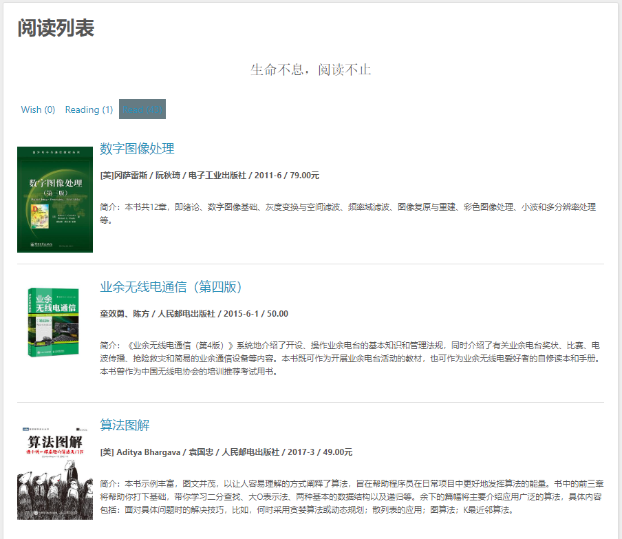

# hexo-books

[](https://www.npmjs.com/package/hexo-books)

## 介绍

**为 Hexo 添加阅读页面，数据来自[豆瓣读书](https://book.douban.com/).**

## 特色功能

* 支持数据缓存及书目封面图本地化，防止因上游服务挂掉导致连锁效应，爬取好后可纯离线场景下部署
* 极端条件下可通过编辑文件来自定义阅读列表，可自定义添加豆瓣读书上没有的数据
* 总的来说，只要你爬取过这本书，那么就算将来豆瓣读书上把这本书删掉了，你也可以继续使用这本书

## 预览



## 安装

在 Hexo 文件夹下执行:
```bash
$ npm install hexo-books --save
```

## 配置

将下面的配置写入 **站点** 的配置文件 `_config.yml` 中:

``` yaml
books:
  enable: true              # 是否启用
  path: books/index.html    # 生成阅读页面的路径
  show: 1                   # 想读，在读，读过
  title: '阅读列表'          # 标题
  quote: '生命不息，阅读不止' # 格言
  color_meta: "#555"        # 书目项元数据的颜色
  color_summary: "#555"     # 书目项简介的颜色
  douban_uid: mmdjiji       # 豆瓣的uid
  download_image: true      # 下载图片并使用本地图片，否则使用豆瓣提供的网络图源
  lazyload: true            # 是否开启懒加载
  margin: 20px              # 封面图的偏移量微调
```

## 使用

更新阅读数据:
```bash
$ hexo books -u
```

删除阅读数据:
```
$ hexo books -d
```

## Lisense

[Apache Licence 2.0](LICENSE)
